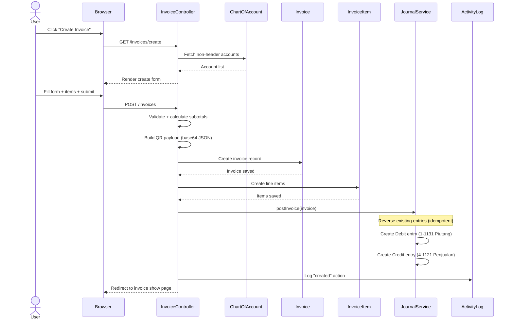
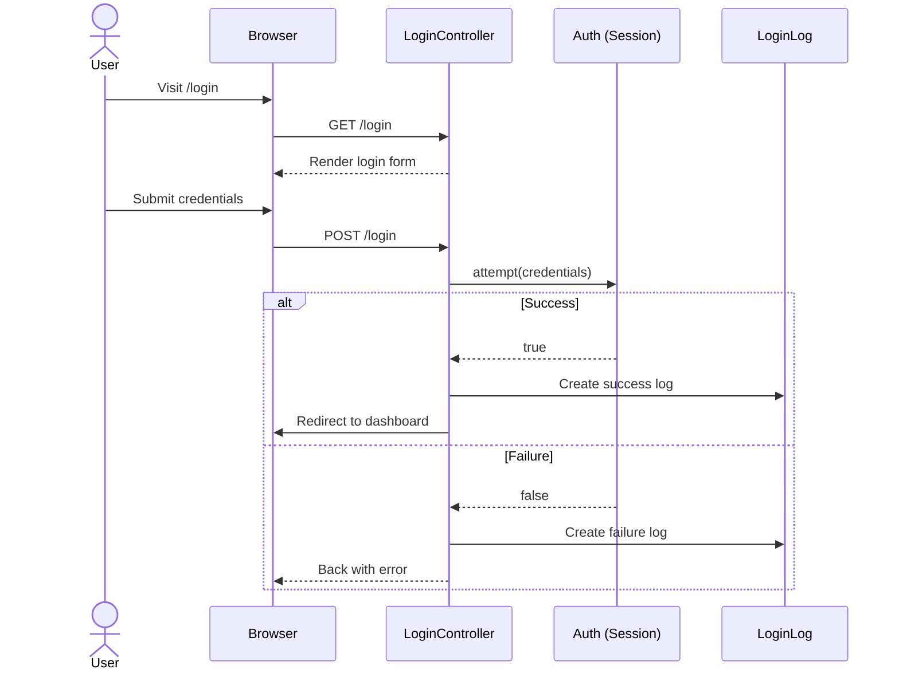
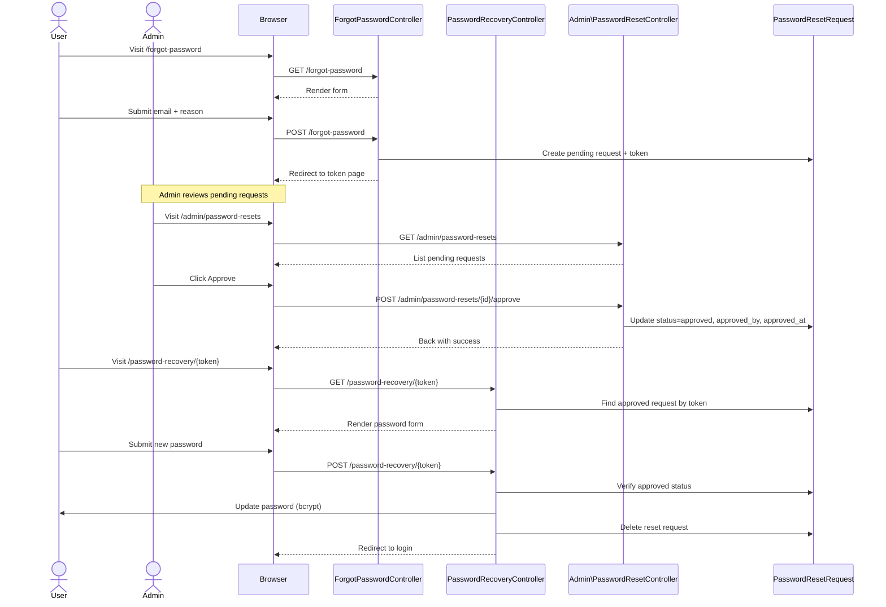
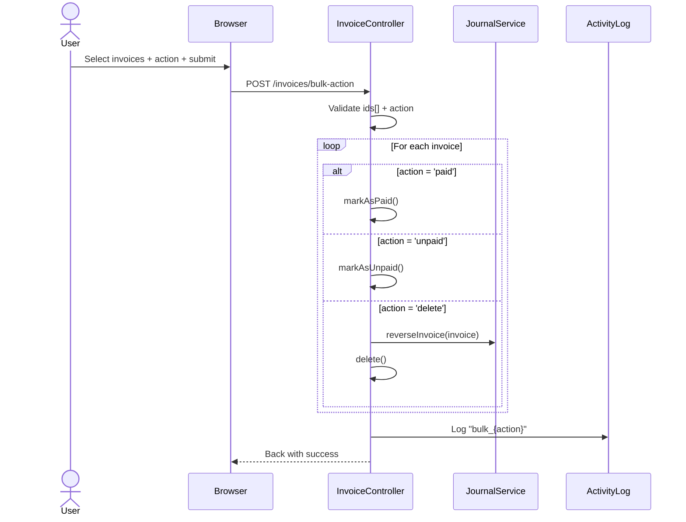

# Application Documentation: Manajemen E-Faktur Penjualan

## 1. Executive Summary

**Purpose:** An Indonesian electronic tax invoice (Faktur Pajak) management system designed for accounting departments. It enables creation, management, and PDF export of sales invoices conforming to Indonesian Directorate General of Taxation (DJP) standards, with integrated double-entry bookkeeping.

**Main Functionality:**
- Invoice CRUD with seller/buyer identity fields (NPWP, name, address)
- Line-item management with per-item Chart of Accounts mapping
- QR code generation (uploaded DJP stamp or generated PDF link)
- Digital signature support (QR stamp or hand-drawn)
- Automatic double-entry journal posting (Accounts Receivable ↔ Revenue)
- General Ledger and Trial Balance views
- CSV import/export for invoices and chart of accounts
- PDF generation (Faktur Pajak format) via DomPDF
- Role-based access control (4 roles: Admin, Manager, Supervisor, Staff)
- Activity logging and login audit trail
- Password reset workflow with admin approval
- Company profile settings

**High-Level Architecture:** Laravel 12 monolith, server-rendered Blade templates using Mazer admin template, SQLite default (MySQL in production), session-based auth with Eloquent, no REST API, no JavaScript framework.

## 2. Technology Stack

| Layer | Technology | Version |
|---|---|---|
| Backend Framework | Laravel | 12.x |
| PHP | PHP | ^8.3 |
| Frontend Template | Mazer Admin (CDN) | Latest |
| CSS Framework | Bootstrap (via Mazer) | 5.x |
| Build Tool | Vite | 6.x |
| Charts | Chart.js (CDN) | 4.x |
| QR Code Library | endroid/qr-code | ^6.1 |
| PDF Generation | barryvdh/laravel-dompdf | ^3.1 |
| Authentication | Laravel Session (web guard) | Built-in |
| API Token Auth | Laravel Sanctum | ^4.0 (installed, unused) |
| Database (default) | SQLite | File-based |
| Database (production) | MySQL | Referenced in README |
| Testing | PHPUnit | ^11.0 |
| CSS Framework (Vite) | Tailwind CSS | ^4.0 (unused in views) |
| HTTP Tunnel | ngrok (supported via middleware) | N/A |

**Third-party Services:** None integrated (no payment gateways, no email sending, no external APIs).

## 3. Project Structure

```
capstonerill/
├── app/
│   ├── Http/
│   │   ├── Controllers/
│   │   │   ├── Auth/
│   │   │   │   ├── LoginController.php          # Login/logout
│   │   │   │   └── RegisterController.php       # Self-registration
│   │   │   ├── Admin/
│   │   │   │   └── PasswordResetController.php   # Admin password reset approval
│   │   │   ├── Controller.php                    # Abstract base controller
│   │   │   ├── ActivityController.php            # Activity log viewer
│   │   │   ├── ChartOfAccountController.php      # Chart of accounts CRUD
│   │   │   ├── CompanyProfileController.php      # Company settings
│   │   │   ├── ForgotPasswordController.php      # Password reset request
│   │   │   ├── HomeController.php                # Dashboard
│   │   │   ├── InvoiceController.php             # Invoice CRUD + bulk ops
│   │   │   ├── InvoicePdfController.php          # PDF preview/download
│   │   │   ├── LedgerController.php              # General Ledger
│   │   │   ├── LoginLogController.php            # Login audit viewer
│   │   │   ├── PasswordRecoveryController.php    # Password recovery form
│   │   │   ├── ProfileController.php             # User profile
│   │   │   ├── ReportController.php              # Reports + import/export
│   │   │   └── UserController.php                # User management
│   │   └── Middleware/
│   │       └── SkipNgrokWarning.php              # Adds ngrok bypass header
│   ├── Models/
│   │   ├── ActivityLog.php
│   │   ├── ChartOfAccount.php
│   │   ├── CompanyProfile.php
│   │   ├── Invoice.php
│   │   ├── InvoiceAdminSupplier.php              # Empty model (unused)
│   │   ├── InvoiceItem.php
│   │   ├── JournalEntry.php
│   │   ├── LoginLog.php
│   │   ├── PasswordResetRequest.php
│   │   └── User.php
│   ├── Providers/
│   │   └── AppServiceProvider.php                # ngrok HTTPS force
│   └── Services/
│       ├── InvoiceNumberService.php              # Sequential invoice numbering
│       └── JournalService.php                    # Double-entry journal posting
├── config/                                       # Laravel config files
├── database/
│   ├── database.sqlite                           # SQLite database file
│   ├── migrations/                               # 27 migration files
│   └── seeders/
│       └── DatabaseSeeder.php                    # Seeds 4 role-based users
├── resources/
│   ├── css/                                      # Custom CSS files
│   ├── js/                                       # Custom JS files
│   └── views/
│       ├── layouts/mazer.blade.php               # Main layout template
│       ├── partials/
│       │   ├── sidebar.blade.php                 # Navigation sidebar
│       │   ├── header.blade.php                  # Top header with user dropdown
│       │   └── footer.blade.php                  # Footer
│       ├── home.blade.php                        # Dashboard
│       ├── invoices/                             # Invoice views (15 files)
│       ├── chart_of_accounts/                    # COA views
│       ├── ledger/                               # General Ledger views
│       ├── reports/                              # Reports views
│       ├── users/                                # User management views
│       ├── activity/                             # Activity/login log views
│       ├── admin/                                # Admin password reset views
│       ├── profile/                              # User profile views
│       ├── settings/                             # Company settings views
│       ├── auth/                                 # Forgot password views
│       └── login/                                # Login page
├── routes/
│   ├── web.php                                   # All routes (auth middleware group)
│   └── console.php                               # Artisan console routes (empty)
├── templates/mazer/                              # Mazer template source files
├── tests/                                        # PHPUnit tests
├── composer.json
├── package.json
├── vite.config.js
└── DOCUMENTATION.md                              # This file
```

## 4. System Architecture

**Architectural Style:** Monolithic MVC (Model-View-Controller) with Service Layer for business logic.

**Component Relationships:**
```
┌─────────────┐     ┌──────────────────┐     ┌─────────────────┐
│   Browser    │────▶│  Laravel Router   │────▶│   Controllers   │
│  (Blade UI)  │◀────│   (web.php)       │◀────│   (16 classes)  │
└─────────────┘     └──────────────────┘     └────────┬────────┘
                                                       │
                              ┌─────────────────────────┼─────────────────┐
                              │                         │                 │
                    ┌─────────▼────────┐    ┌───────────▼──┐    ┌────────▼────────┐
                    │    Eloquent      │    │   Services    │    │   Blade Views   │
                    │    Models (10)   │    │  (2 classes)  │    │   (40+ files)   │
                    └─────────┬────────┘    └───────────────┘    └─────────────────┘
                              │
                    ┌─────────▼────────┐
                    │    Database       │
                    │  (SQLite/MySQL)   │
                    │  (15+ tables)     │
                    └──────────────────┘
```

**Dependency Flow:**
- Controllers → Models (Eloquent ORM)
- Controllers → Services (JournalService, InvoiceNumberService)
- Models → Database (via Eloquent)
- Views → Controllers (via route parameters)
- JournalService → JournalEntry model
- InvoiceNumberService → invoice_counter table (raw DB)

## 5. Database Documentation

### Table: users

**Purpose:** Stores user accounts with role-based access.

| Column | Type | Nullable | Default |
|---|---|---|---|
| id | bigint (PK, auto) | No | auto |
| name | string | No | - |
| email | string (unique) | No | - |
| email_verified_at | timestamp | Yes | null |
| password | string (hashed) | No | - |
| remember_token | string | Yes | null |
| role | string | No | 'Accounting Staff' |
| created_at | timestamp | No | current_time |
| updated_at | timestamp | No | current_time |

**Relationships:** Has many activity_logs, login_logs; has many password_resets_requests (via user_id).

**Business Rules:**
- Role is one of: 'Accounting Admin', 'Accounting Manager', 'Accounting Supervisor', 'Accounting Staff'
- Passwords are hashed via bcrypt
- Role hierarchy: Admin (4) > Manager (3) > Supervisor (2) > Staff (1)

---

### Table: invoices

**Purpose:** Core table storing electronic tax invoices (Faktur Pajak).

| Column | Type | Nullable | Default |
|---|---|---|---|
| id | bigint (PK, auto) | No | auto |
| nomor | string (unique) | No | - |
| tanggal | date | No | - |
| npwp | string(32) | Yes | null (legacy) |
| nama | string | Yes | null (legacy) |
| alamat | string | Yes | null (legacy) |
| npwp_penjual | string(32) | Yes | null |
| nama_penjual | string(255) | Yes | null |
| alamat_penjual | string(255) | Yes | null |
| npwp_pembeli | string(32) | Yes | null |
| nama_pembeli | string(255) | Yes | null |
| alamat_pembeli | string(255) | Yes | null |
| pejabat | string(255) | Yes | null |
| role_penandatangan | string(255) | Yes | null |
| signature_type | string | Yes | null |
| signature_data | longText | Yes | null |
| signature_data_uri | longText | Yes | null |
| signature_name | string | Yes | null |
| signature_signed_at | timestamp | Yes | null |
| qr_payload | longText | Yes | null |
| qr_image | longText | Yes | null |
| total | decimal(15,2) | No | 0 |
| currency | string(3) | No | 'IDR' |
| status | string | No | 'unpaid' |
| paid_at | timestamp | Yes | null |
| notes | text | Yes | null |
| created_by | bigint (FK→users) | Yes | null |
| deleted_at | timestamp (soft) | Yes | null |
| created_at | timestamp | No | current_time |
| updated_at | timestamp | No | current_time |

**Relationships:** Has many invoice_items; belongs to User (created_by→creator).

**Business Rules:**
- `nomor` must be unique across all invoices
- `total` is computed server-side from items, not trusted from client
- `status` is 'paid' or 'unpaid'
- Soft deletes enabled (deleted_at)

---

### Table: invoice_items

**Purpose:** Line items belonging to an invoice.

| Column | Type | Nullable | Default |
|---|---|---|---|
| id | bigint (PK, auto) | No | auto |
| invoice_id | bigint (FK→invoices) | No | cascade delete |
| chart_of_account_no_new | string(6) | Yes | null |
| nama_produk | string | No | - |
| qty | unsigned int | No | 1 |
| harga | decimal(15,2) | No | 0 |
| diskon | decimal(15,2) | No | 0 |
| subtotal | decimal(15,2) | No | 0 |
| created_at | timestamp | No | current_time |
| updated_at | timestamp | No | current_time |

**Relationships:** Belongs to Invoice; belongs to ChartOfAccount (chart_of_account_no_new→account_no_new).

**Business Rules:**
- subtotal = (harga × qty) - diskon, floored at 0
- chart_of_account_no_new optionally links to a Chart of Accounts entry

---

### Table: chart_of_accounts

**Purpose:** Indonesian accounting chart of accounts.

| Column | Type | Nullable | Default |
|---|---|---|---|
| account_no_new | string(6) (PK) | No | - |
| account_no_old_1 | string(4) | Yes | null |
| account_no_old_2 | integer | Yes | null |
| account_name | string(37) | No | - |
| is_header | string(1) | Yes | null |
| account_type | string(19) | Yes | null |

**Relationships:** Referenced by invoice_items and journal_entries.

**Business Rules:**
- Primary key is `account_no_new` (non-auto-incrementing string)
- No timestamps
- Header accounts (is_header='H') are filtered out of selection dropdowns
- Cannot delete an account that is referenced by invoice_items

---

### Table: journal_entries

**Purpose:** Double-entry bookkeeping journal entries.

| Column | Type | Nullable | Default |
|---|---|---|---|
| id | bigint (PK, auto) | No | auto |
| date | date | No | - |
| account_no | string(6) | No | - |
| debit | decimal(15,2) | No | 0 |
| credit | decimal(15,2) | No | 0 |
| reference_type | string | Yes | null |
| reference_id | bigint | Yes | null |
| description | string | Yes | null |
| created_at | timestamp | No | current_time |
| updated_at | timestamp | No | current_time |

**Indexes:** account_no, [reference_type, reference_id], date.

**Relationships:** Belongs to ChartOfAccount (account_no→account_no_new); polymorphic reference (reference_type/reference_id).

**Business Rules:**
- Each entry is either a debit or credit (never both non-zero)
- Debit + Credit entries for same reference are balanced (zero-sum)
- reference_type = 'App\Models\Invoice' for invoice-related entries

---

### Table: invoice_counter

**Purpose:** Generates sequential invoice numbers per year.

| Column | Type | Nullable | Default |
|---|---|---|---|
| id | bigint (PK, auto) | No | auto |
| year | string(4) (unique) | No | - |
| last_number | unsigned int | No | 0 |
| created_at | timestamp | No | current_time |
| updated_at | timestamp | No | current_time |

**Business Rules:**
- One row per year; incremented atomically with `lockForUpdate()`
- Invoice numbers format: `INV-YYYY-NNNN` (e.g., INV-2026-0001)

---

### Table: activity_logs

**Purpose:** Audit trail of user actions on invoices and bulk operations.

| Column | Type | Nullable | Default |
|---|---|---|---|
| id | bigint (PK, auto) | No | auto |
| user_id | bigint (FK→users) | Yes | null (on delete null) |
| action | string | No | - |
| subject_type | string | Yes | null |
| subject_id | bigint | Yes | null |
| description | text | Yes | null |
| created_at | timestamp | No | current_time |
| updated_at | timestamp | No | current_time |

**Indexes:** [subject_type, subject_id].

**Relationships:** Belongs to User; polymorphic subject.

---

### Table: company_profiles

**Purpose:** Singleton company profile for invoice header/logo.

| Column | Type | Nullable | Default |
|---|---|---|---|
| id | bigint (PK, auto) | No | auto |
| name | string | Yes | null |
| npwp | string(32) | Yes | null |
| address | text | Yes | null |
| phone | string | Yes | null |
| email | string | Yes | null |
| logo | text | Yes | null (stores base64 data URI) |
| created_at | timestamp | No | current_time |
| updated_at | timestamp | No | current_time |

**Business Rules:**
- Singleton pattern via `getProfile()` (firstOrCreate)
- Logo stored as base64 data URI in the database

---

### Table: login_logs

**Purpose:** Audit trail of all login attempts (success and failure).

| Column | Type | Nullable | Default |
|---|---|---|---|
| id | bigint (PK, auto) | No | auto |
| user_id | bigint (FK→users) | Yes | null (on delete null) |
| email | string | No | - |
| success | boolean | No | false |
| ip_address | string(45) | Yes | null |
| user_agent | text | Yes | null |
| logged_at | timestamp | Yes | null |
| created_at | timestamp | No | current_time |
| updated_at | timestamp | No | current_time |

**Indexes:** user_id, logged_at.

**Relationships:** Belongs to User.

---

### Table: password_resets_requests

**Purpose:** Admin-approved password reset workflow.

| Column | Type | Nullable | Default |
|---|---|---|---|
| id | bigint (PK, auto) | No | auto |
| user_id | bigint (FK→users) | No | cascade delete |
| status | enum('pending','approved','rejected') | No | 'pending' |
| token | string(64, unique) | No | - |
| ip_address | string(45) | Yes | null |
| user_agent | text | Yes | null |
| reason | text | Yes | null |
| approved_by | bigint (FK→users) | Yes | null (on delete null) |
| approved_at | timestamp | Yes | null |
| created_at | timestamp | No | current_time |
| updated_at | timestamp | No | current_time |

**Relationships:** Belongs to User (user_id); belongs to User (approved_by→approver).

---

### Table: sessions

**Purpose:** Laravel session storage (database driver).

| Column | Type | Nullable | Default |
|---|---|---|---|
| id | string (PK) | No | - |
| user_id | bigint (FK→users) | Yes | null |
| ip_address | string(45) | Yes | null |
| user_agent | text | Yes | null |
| payload | longText | No | - |
| last_activity | integer | No | - |

---

### Table: cache / cache_locks

**Purpose:** Laravel cache storage (database driver).

| Table | Columns |
|---|---|
| cache | key (PK), value (mediumText), expiration (int) |
| cache_locks | key (PK), owner (string), expiration (int) |

---

### Table: jobs / job_batches / failed_jobs

**Purpose:** Laravel queue system tables (database driver). Currently unused — no queue jobs are dispatched.

---

## 6. Authentication & Authorization

### Login Flow
1. User navigates to `/login` → `LoginController::showLoginForm` renders `login.login` view
2. User submits email + password + optional "remember me" → `POST /login` (throttled: 5 per minute)
3. `LoginController::login` validates credentials via `Auth::attempt()`
4. On success: session regenerated, `LoginLog` recorded (success=true), redirect to intended URL or home
5. On failure: `LoginLog` recorded (success=false, email only, no user_id), back with error

### Registration Flow
1. `POST /register` (throttled: 3 per minute) → `RegisterController::register`
2. Validates name, email (unique), password (min:4)
3. Creates User with default role 'Accounting Staff' (no role parameter accepted)
4. Auto-logs in the new user via `Auth::login()`
5. Redirects to invoices index

### Password Reset Flow (Admin-Approved)
1. User visits `/forgot-password` → submits email + reason
2. System creates `PasswordResetRequest` with status='pending', generates random 64-char token
3. User is redirected to `/password-recovery/{token}` — but cannot set password yet
4. Admin/Manager visits `/admin/password-resets` → sees pending requests
5. Admin approves → status changes to 'approved', approved_by and approved_at set
6. User revisits `/password-recovery/{token}` → can now set new password
7. Password updated, request deleted, user redirected to login

### Session Handling
- Session driver: database
- Session lifetime: 120 minutes
- Session encryption: disabled
- CSRF protection: enabled (Blade @csrf)

### Role-Based Access Control

| Role | Level | Capabilities |
|---|---|---|
| Accounting Admin | 4 | Full access: manage all users (any role), COA CRUD, reports, import/export, settings, password resets, all invoices |
| Accounting Manager | 3 | Manage Supervisor/Staff users, COA CRUD, reports, import/export, all invoices, password resets |
| Accounting Supervisor | 2 | Manage Staff users, view reports, view invoices |
| Accounting Staff | 1 | View-only for most features, own login logs only |

**Permission Matrix (verified from code):**

| Feature | Admin | Manager | Supervisor | Staff |
|---|---|---|---|---|
| Create invoices | Yes | Yes | Yes | Yes |
| Delete invoices | Yes | Yes | Yes | Yes |
| COA create/edit/delete | Yes | Yes | No | No |
| Export CSV | Yes | Yes | Yes | No |
| Import CSV | Yes | Yes | Yes | No |
| User create/edit/delete | All roles | Supervisor+Staff | Staff only | No |
| Activity log view | Yes | Yes | No | No |
| Login log view | All users | Supervisor+Staff+own | Staff+own | Own only |
| Password reset admin | Yes | Yes | No | No |
| Company settings | Yes | No | No | No |

## 7. API Documentation

This application has **no REST API**. All routes are web routes returning Blade views or CSV streams. Authentication is session-based.

### Route Table

| Method | URI | Controller | Purpose | Auth | Throttle |
|---|---|---|---|---|---|
| GET | `/login` | LoginController@showLoginForm | Show login form | No | No |
| POST | `/login` | LoginController@login | Process login | No | 5/min |
| POST | `/logout` | Auth\LoginController@logout | Logout | Yes | No |
| POST | `/register` | RegisterController@register | Self-register | No | 3/min |
| GET | `/forgot-password` | ForgotPasswordController@showForm | Show reset request form | No | No |
| POST | `/forgot-password` | ForgotPasswordController@submit | Submit reset request | No | 3/min |
| GET | `/password-recovery/{token}` | PasswordRecoveryController@showForm | Show password form | No | No |
| POST | `/password-recovery/{token}` | PasswordRecoveryController@updatePassword | Set new password | No | No |
| GET | `/` | HomeController@index | Dashboard | Yes | No |
| GET | `/profile` | ProfileController@show | View profile | Yes | No |
| GET | `/profile/edit` | ProfileController@edit | Edit profile form | Yes | No |
| PUT | `/profile` | ProfileController@update | Update profile | Yes | No |
| PUT | `/profile/password` | ProfileController@updatePassword | Change password | Yes | No |
| GET | `/chart-of-accounts` | ChartOfAccountController@index | List COA | Yes | No |
| GET | `/chart-of-accounts/create` | ChartOfAccountController@create | Create COA form | Yes* | No |
| POST | `/chart-of-accounts` | ChartOfAccountController@store | Store COA | Yes* | No |
| GET | `/chart-of-accounts/{id}` | ChartOfAccountController@show | View COA | Yes | No |
| GET | `/chart-of-accounts/{id}/edit` | ChartOfAccountController@edit | Edit COA form | Yes* | No |
| PUT | `/chart-of-accounts/{id}` | ChartOfAccountController@update | Update COA | Yes* | No |
| DELETE | `/chart-of-accounts/{id}` | ChartOfAccountController@destroy | Delete COA | Yes* | No |
| GET | `/invoices` | InvoiceController@index | List invoices | Yes | No |
| GET | `/invoices/create` | InvoiceController@create | Create invoice form | Yes | No |
| POST | `/invoices` | InvoiceController@store | Store invoice | Yes | No |
| GET | `/invoices/{id}` | InvoiceController@show | View invoice | Yes | No |
| GET | `/invoices/{id}/edit` | InvoiceController@edit | Edit invoice form | Yes | No |
| PUT | `/invoices/{id}` | InvoiceController@update | Update invoice | Yes | No |
| DELETE | `/invoices/{id}` | InvoiceController@destroy | Delete invoice | Yes | No |
| POST | `/invoices/{id}/mark-paid` | InvoiceController@markPaid | Mark paid | Yes | No |
| POST | `/invoices/{id}/mark-unpaid` | InvoiceController@markUnpaid | Mark unpaid | Yes | No |
| GET | `/invoices/{id}/qr` | InvoiceController@qr | Get QR image | Yes | No |
| GET | `/invoices/{id}/preview` | InvoicePdfController@preview | HTML preview | Yes | No |
| GET | `/invoices/{id}/pdf` | InvoicePdfController@show | Download PDF | Yes | No |
| GET | `/invoices/{id}/duplicate` | InvoiceController@duplicate | Duplicate invoice | Yes | No |
| POST | `/invoices/bulk-action` | InvoiceController@bulkAction | Bulk mark/delete | Yes | No |
| GET | `/users` | UserController@index | List users | Yes | No |
| GET | `/users/create` | UserController@create | Create user form | Yes** | No |
| POST | `/users` | UserController@store | Store user | Yes** | No |
| GET | `/users/{id}/edit` | UserController@edit | Edit user form | Yes*** | No |
| PUT | `/users/{id}` | UserController@update | Update user | Yes*** | No |
| DELETE | `/users/{id}` | UserController@destroy | Delete user | Yes** | No |
| GET | `/activity` | ActivityController@index | Activity log | Yes**** | No |
| GET | `/activity/login-logs` | LoginLogController@index | Login logs | Yes | No |
| GET | `/admin/password-resets` | Admin\PasswordResetController@index | List reset requests | Yes**** | No |
| POST | `/admin/password-resets/{id}/approve` | Admin\PasswordResetController@approve | Approve reset | Yes**** | No |
| POST | `/admin/password-resets/{id}/reject` | Admin\PasswordResetController@reject | Reject reset | Yes**** | No |
| GET | `/settings/company` | CompanyProfileController@edit | Company settings | Yes***** | No |
| PUT | `/settings/company` | CompanyProfileController@update | Update company | Yes***** | No |
| GET | `/ledger` | LedgerController@index | General Ledger | Yes | No |
| GET | `/ledger/{accountNo}` | LedgerController@show | Account detail | Yes | No |
| GET | `/reports/sales` | ReportController@sales | Sales report | Yes | No |
| GET | `/reports/export-invoices` | ReportController@exportInvoices | Export CSV | Yes*** | No |
| GET | `/reports/export-ledger` | ReportController@exportLedger | Export ledger CSV | Yes*** | No |
| GET | `/reports/import` | ReportController@importForm | Import form | Yes*** | No |
| POST | `/reports/import-invoices` | ReportController@importInvoices | Import invoices CSV | Yes*** | No |
| POST | `/reports/import-coa` | ReportController@importChartOfAccounts | Import COA CSV | Yes*** | No |
| GET | `/reports/template-invoices` | ReportController@templateInvoices | Download invoice CSV template | Yes*** | No |
| GET | `/reports/template-coa` | ReportController@templateChartOfAccounts | Download COA CSV template | Yes*** | No |

\* Admin or Manager only
\** Admin, Manager, or Supervisor only
\*** Admin, Manager, or Supervisor only (enforced in controller)
\**** Admin or Manager only (sidebar visibility enforced in Blade)
\***** Admin only (sidebar visibility enforced in Blade)

## 8. Frontend Documentation

### Layout
- **Base layout:** `layouts/mazer.blade.php` — Mazer admin template loaded from CDN
- **Navigation:** Sidebar (`partials/sidebar.blade.php`) with collapsible sections
- **Dark mode:** Toggle switch in sidebar header, persisted via localStorage
- **Language:** Indonesian (lang="id")

### Page: Dashboard (`/`)
**Route:** `GET /` (name: `home`)
**View:** `home.blade.php`
**Components:**
- 4 stat cards: Total Invoices, Total Revenue, Paid count, Unpaid count
- Revenue per Month bar chart (Chart.js)
- Payment Status doughnut chart (Chart.js)
- Payment summary with collection rate percentage
- Unpaid invoices table (top 5)
- Recent invoices table (top 5)
- Top 5 account balances sidebar

### Page: Login (`/login`)
**Route:** `GET /login` (name: `login`)
**View:** `login/login.blade.php`
**Components:** Email field, password field, remember me checkbox, submit button, forgot password link

### Page: Invoice List (`/invoices`)
**Route:** `GET /invoices` (name: `invoices.index`)
**View:** `invoices/index.blade.php`
**Components:**
- Search filter (nomor/penjual/pembeli)
- Status filter (all/paid/unpaid)
- Date range filter (from/to)
- Bulk action form (mark paid/unpaid/delete) with select-all checkbox
- Paginated invoice table (10 per page)
- "Create Invoice" button

### Page: Invoice Detail (`/invoices/{id}`)
**Route:** `GET /invoices/{id}` (name: `invoices.show`)
**View:** `invoices/show.blade.php`
**Components:**
- Invoice details (nomor, tanggal, status, creator, seller, buyer, total, notes)
- QR payload display (base64 JSON)
- Items table (product, account, qty, price, discount, subtotal)
- QR/signature display panel (DJP image or placeholder)
- Action buttons: Mark paid/unpaid, Preview Faktur, Edit, Duplicate, New Invoice, Delete

### Page: Invoice Create/Edit
**Routes:** `GET /invoices/create`, `GET /invoices/{id}/edit`
**Views:** `invoices/create.blade.php`, `invoices/edit.blade.php`
**Form:** `invoices/_form.blade.php` (shared partial)
**Components:**
- Invoice number (unique, text)
- Date picker
- Signature type selector (QR stamp / Hand drawn)
- QR image upload (for QR type) or signature canvas (for hand type)
- Signatory name and role fields
- Seller identity (NPWP, name, address)
- Buyer identity (NPWP, name, address)
- Currency selector (default IDR)
- Dynamic items section (add/remove rows)
  - Product name, Chart of Account dropdown, Quantity, Price, Discount
- Notes textarea
- Auto-calculated total display

### Page: Invoice PDF Preview/Download
**Routes:** `GET /invoices/{id}/preview`, `GET /invoices/{id}/pdf`
**Views:** `invoices/preview.blade.php` (HTML), `invoices/cetakfaktur.blade.php` (PDF template)
**Template:** Indonesian Faktur Pajak format with:
- Header: "Faktur Pajak"
- Serial number bar
- Pengusaha Kena Pajak (seller) section
- Pembeli (buyer) section
- Items table with prices
- Summary table (total, discounts, PPN, PPnBM)
- Legal notice text
- QR/stamp signature area
- Warning text about tax compliance

### Page: Chart of Accounts List (`/chart-of-accounts`)
**Route:** `GET /chart-of-accounts` (name: `chart-of-accounts.index`)
**View:** `chart_of_accounts/index.blade.php`
**Components:**
- Search by account number or name
- Paginated table (20 per page)
- Create button (Admin/Manager only)
- View/Edit/Delete buttons per row (Admin/Manager only)

### Page: General Ledger (`/ledger`)
**Route:** `GET /ledger` (name: `ledger.index`)
**View:** `ledger/index.blade.php`
**Components:**
- Account balance summary table
- Shows only accounts with activity (debit or credit > 0)
- Columns: Account code, Account name, Total Debit, Total Credit, Balance
- Total row at bottom
- Click account to view detail

### Page: Ledger Detail (`/ledger/{accountNo}`)
**Route:** `GET /ledger/{accountNo}` (name: `ledger.show`)
**View:** `ledger/show.blade.php`
**Components:**
- Account info header
- Date range filter
- Journal entries table (paginated, 20 per page)
- Columns: Date, Description, Debit, Credit
- Running balance display
- Total debit/credit for filtered period

### Page: Sales Report (`/reports/sales`)
**Route:** `GET /reports/sales` (name: `reports.sales`)
**View:** `reports/sales.blade.php`
**Components:**
- Date range and status filters
- Summary cards: Total invoices, Total revenue, Paid count/amount, Unpaid count/amount
- Monthly breakdown table
- Detailed invoice list
- Export CSV button

### Page: Import/Export (`/reports/import`)
**Route:** `GET /reports/import` (name: `reports.import-form`)
**View:** `reports/import.blade.php`
**Components:**
- Import Invoices: CSV file upload
- Import Chart of Accounts: CSV file upload
- Template download buttons

### Page: Users (`/users`)
**Route:** `GET /users` (name: `users.index`)
**View:** `users/index.blade.php`
**Components:**
- Paginated user list (10 per page)
- Create button (Admin/Manager/Supervisor only)
- Edit/Delete per row (hierarchical permissions)

### Page: Profile (`/profile`, `/profile/edit`)
**Views:** `profile/show.blade.php`, `profile/edit.blade.php`
**Components:**
- Profile display: name, email, role
- Edit form: name, email, current password required
- Separate password change form

### Page: Company Settings (`/settings/company`)
**Route:** `GET /settings/company` (name: `settings.company`)
**View:** `settings/company.blade.php`
**Components:**
- Company name, NPWP, address, phone, email fields
- Logo upload (PNG/JPG, max 2MB, stored as base64)

## 9. Feature Documentation

### Feature: Invoice Management

**Objective:** Create, view, edit, delete, and manage payment status of electronic tax invoices.

**User Flow:**
1. User clicks "Create Invoice" → fills in invoice details and line items
2. System validates all fields, calculates subtotals server-side
3. System generates QR payload (base64 JSON with invoice metadata)
4. System creates invoice, creates line items, posts journal entries
5. System logs activity
6. User can view, edit, duplicate, mark paid/unpaid, or delete

**Business Rules:**
- Invoice numbers are unique and sequential (INV-YYYY-NNNN)
- Subtotals are server-computed: (harga × qty) - diskon, minimum 0
- Invoice total is sum of item subtotals
- QR payload is base64-encoded JSON containing: app name, nomor, tanggal, seller/buyer info, total, currency
- Two signature types: 'qr' (DJP QR image upload) or 'hand' (base64 hand-drawn signature)
- QR image is stored as base64 data URI in the database
- Soft deletes enabled — deleted invoices are not permanently removed
- Every invoice is attributed to a creator (created_by → User)

**Dependencies:** ChartOfAccount (for item account mapping), JournalService, InvoiceNumberService, ActivityLog

**Related Files:** `InvoiceController.php`, `Invoice.php`, `InvoiceItem.php`, `InvoicePdfController.php`, `JournalService.php`, `InvoiceNumberService.php`

---

### Feature: Double-Entry Journal Posting

**Objective:** Automatically post balanced journal entries for every invoice create/update/delete.

**User Flow:**
1. On invoice create/update → `JournalService::postInvoice()` called
2. Any existing entries for this invoice are first reversed (deleted)
3. Two balanced entries created: Debit Piutang (1-1131), Credit Penjualan (4-1121)
4. On invoice delete → `JournalService::reverseInvoice()` deletes all entries for that invoice

**Business Rules:**
- Hardcoded accounts: `1-1131` (Piutang/Accounts Receivable) and `4-1121` (Penjualan/Revenue)
- Idempotent: safe to call multiple times (reverses before posting)
- Wrapped in DB transaction for atomicity
- Every entry references the invoice via polymorphic columns (reference_type, reference_id)

**Dependencies:** JournalEntry model, Invoice model

**Related Files:** `JournalService.php`, `JournalEntry.php`

---

### Feature: Chart of Accounts Management

**Objective:** Maintain the Indonesian accounting chart of accounts used for invoice item classification and journal entries.

**User Flow:**
1. Admin/Manager creates COA entries (account_no_new, name, type, header flag)
2. Users select COA accounts when creating invoice items
3. Ledger and Trial Balance aggregate journal entries by account

**Business Rules:**
- Account number (account_no_new) is string primary key, max 6 chars
- Header accounts (is_header='H') are excluded from item selection dropdowns
- Cannot delete accounts that are referenced by invoice_items
- CSV import uses updateOrCreate (upsert)

**Dependencies:** ChartOfAccount model, InvoiceItem model

---

### Feature: General Ledger

**Objective:** Display aggregated debit/credit/balance for each account, with drill-down to individual journal entries.

**User Flow:**
1. User views aggregated balances across all accounts with activity
2. Clicks an account to see filtered journal entries with date range filter
3. Can export ledger to CSV

**Business Rules:**
- Balance = SUM(debit) - SUM(credit) per account
- Only accounts with activity (debit > 0 or credit > 0) are shown
- Entries paginated (20 per page), ordered by date descending

**Related Files:** `LedgerController.php`, `JournalService.php`

---


---

### Feature: Sales Reporting

**Objective:** Provide filtered views of invoice data with monthly breakdowns and summary statistics.

**User Flow:**
1. User applies date range and status filters
2. Views summary cards and monthly breakdown table
3. Sees detailed invoice list with links to individual invoices
4. Can export filtered results to CSV

**Business Rules:**
- Summary includes: total invoices, total revenue, paid/unpaid counts and amounts
- Monthly data groups invoices by year-month

**Related Files:** `ReportController.php`, `reports/sales.blade.php`

---

### Feature: CSV Import/Export

**Objective:** Bulk data operations for invoices and chart of accounts.

**User Flow:**
1. Admin/Manager/Supervisor navigates to Import/Export page
2. Downloads CSV template for reference
3. Uploads CSV file for invoices or chart of accounts
4. System processes rows, reports successes and errors

**Business Rules:**
- Invoice import: duplicates by nomor are skipped (not overwritten)
- Imported invoices default to 'unpaid' status
- COA import uses updateOrCreate (upserts by account_no_new)
- CSV max size: 5MB
- Template files provide sample data with correct column headers

**Related Files:** `ReportController.php`, `reports/import.blade.php`

---

### Feature: PDF Generation (Faktur Pajak)

**Objective:** Generate downloadable PDFs in Indonesian Faktur Pajak format.

**User Flow:**
1. User clicks "Preview Faktur" → sees HTML preview
2. User clicks "Download PDF" → receives PDF file

**Business Rules:**
- PDF format follows Indonesian DJP Faktur Pajak layout
- Includes: seller/buyer identity, items with prices, total, tax summary, QR stamp
- Uses DomPDF with A4 portrait paper
- Remote resource loading enabled for external CSS/fonts in PDF template
- PDF filename format: `faktur-{nomor}.pdf`

**Related Files:** `InvoicePdfController.php`, `invoices/cetakfaktur.blade.php`, `invoices/preview.blade.php`

---

### Feature: QR Code Generation

**Objective:** Generate QR codes for invoice verification.

**User Flow:**
1. User clicks QR icon/link → receives QR code image

**Business Rules:**
- Priority: If DJP-provided QR image exists (qr_image column), return it directly
- Fallback: Generate QR code linking to the invoice PDF URL using endroid/qr-code library
- QR payload: base64-encoded JSON with invoice metadata
- QR size: 280×280px, high error correction

**Related Files:** `InvoiceController::qr()`

---

### Feature: Role-Based Access Control

**Objective:** Enforce hierarchical permissions across all application features.

**User Flow:**
1. On login, user's role determines visible sidebar items and accessible actions
2. Higher roles can manage lower roles (cannot modify equal or higher)
3. Self-edit requires current password verification

**Business Rules:**
- Role hierarchy: Admin(4) > Manager(3) > Supervisor(2) > Staff(1)
- Users cannot modify their own role
- Users cannot delete themselves
- Manager can only assign Supervisor or Staff roles
- Supervisor can only assign Staff role
- Self-edit always requires current password

**Related Files:** `UserController.php`, `User.php`, sidebar visibility in `sidebar.blade.php`

---

### Feature: Activity Logging

**Objective:** Maintain audit trail of invoice-related actions.

**User Flow:**
1. Every invoice create/update/delete/status change is logged
2. Bulk operations are logged with summary description
3. Admin/Manager can view activity log

**Business Rules:**
- Logs include: user_id, action type, subject type/id, description
- Actions: 'created', 'updated', 'deleted', 'bulk_paid', 'bulk_unpaid', 'bulk_delete'
- Activity log viewer restricted to Admin and Manager roles (sidebar visibility)

**Related Files:** `ActivityController.php`, `ActivityLog.php`

---

### Feature: Login Logging

**Objective:** Track all login attempts for security auditing.

**User Flow:**
1. Every login attempt (success or failure) creates a LoginLog entry
2. Users view logs based on their role hierarchy

**Business Rules:**
- Successful logins: user_id, email, success=true, IP, user agent, timestamp
- Failed logins: email only (no user_id), success=false, IP, user agent, timestamp
- Staff sees own logs only
- Supervisor sees Staff + own logs
- Manager sees Supervisor + Staff + own logs
- Admin sees all logs

**Related Files:** `LoginLogController.php`, `LoginLog.php`, `LoginController.php`

---

### Feature: Admin Password Reset

**Objective:** Allow users to request password resets that require admin approval before the new password can be set.

**User Flow:**
1. User submits email + reason on forgot-password form
2. System creates pending PasswordResetRequest with random token
3. User directed to token page (but cannot set password yet)
4. Admin approves/rejects via admin panel
5. If approved, user can set new password via the token link

**Business Rules:**
- Token is random 64-character string
- Request includes IP address and user agent for audit
- Approval records: approved_by (admin user), approved_at timestamp
- After password is changed, the request is deleted (one-time use)

**Related Files:** `ForgotPasswordController.php`, `PasswordRecoveryController.php`, `Admin\PasswordResetController.php`

---

### Feature: Company Profile

**Objective:** Store and display company information for invoice headers.

**User Flow:**
1. Admin navigates to Settings → Company
2. Fills in company name, NPWP, address, phone, email, logo
3. Logo uploaded as image, stored as base64 data URI

**Business Rules:**
- Singleton pattern: only one company profile exists
- Logo: PNG/JPG, max 2MB, stored as base64 data URI
- Accessible only by Admin role

**Related Files:** `CompanyProfileController.php`, `CompanyProfile.php`

## 10. Service Layer Documentation

### Service: JournalService

**Responsibility:** Manages double-entry bookkeeping journal entries for invoices.

**Methods:**

| Method | Input | Output | Description |
|---|---|---|---|
| `postInvoice(Invoice)` | Invoice model | void | Creates balanced debit/credit entries for an invoice. Idempotent. |
| `reverseInvoice(Invoice)` | Invoice model | void | Deletes all journal entries for an invoice. |
| `getBalance(string)` | Account number | float | Returns balance (debit - credit) for a single account. |
| `getAccountBalances()` | none | array | Returns aggregated debit/credit/balance for all active accounts. |

**Dependencies:** JournalEntry model, Invoice model, DB facade

---

### Service: InvoiceNumberService

**Responsibility:** Generates unique sequential invoice numbers.

**Methods:**

| Method | Input | Output | Description |
|---|---|---|---|
| `generate()` | none | string | Returns next invoice number in format `INV-YYYY-NNNN`. |

**Dependencies:** DB facade (lockForUpdate for concurrency safety)

## 11. Application Flows

### Invoice Creation Flow



### Login Flow



### Password Reset Flow



### Bulk Invoice Action Flow



---

## 12. Bug Detection & Issues

### Issue: RegisterController Creates Users Without Role

**Severity:** High

**Evidence:** `RegisterController.php:21-25` — Creates user without specifying `role` field. The migration adds `role` with default `'Accounting Staff'`, but the controller code does not explicitly set it, relying on the database default.

**Impact:** Self-registered users get role 'Accounting Staff' implicitly via database default. While this works, it's fragile — if the default changes in a future migration, self-registered users could get unexpected roles. No authorization check prevents registration.

**Affected files:** `app/Http/Controllers/Auth/RegisterController.php`

**Recommended fix:** Explicitly set `'role' => User::ROLE_STAFF` in the User::create() call, or consider disabling self-registration entirely (the register route is publicly accessible with no guard).

---

### Issue: Self-Registration is Unprotected

**Severity:** Medium

**Evidence:** `routes/web.php:26` — `POST /register` has no auth middleware, only throttle. Any unauthenticated user can create accounts.

**Impact:** Anyone can register as an Accounting Staff user. This may be intentional for development but is a security concern in production.

**Affected files:** `routes/web.php:26`

**Recommended fix:** Either add `middleware('auth')` to the registration route, or add a registration approval flow.

---

### Issue: Password Recovery Shows Form Even for Non-Approved Requests

**Severity:** Medium

**Evidence:** `PasswordRecoveryController::showForm()` checks if token exists but does not check if status is 'approved'. The `updatePassword()` method correctly checks for 'approved' status, but the form is shown regardless.

**Impact:** Users see a password form they can submit but will get a 404 error if the request is still pending. Confusing UX.

**Affected files:** `app/Http/Controllers/PasswordRecoveryController.php:12-19`

**Recommended fix:** Check status in `showForm()` and display an appropriate message (e.g., "Your request is pending admin approval") instead of the password form.

---

### Issue: DATE_FORMAT Function May Not Work on SQLite

**Severity:** Low

**Evidence:** `HomeController.php:23-24` uses `DATE_FORMAT(tanggal, "%Y-%m")` which is MySQL syntax. The default database is SQLite, which uses `strftime()` instead.

**Impact:** Dashboard may fail or produce incorrect monthly data when using SQLite.

**Affected files:** `app/Http/Controllers/HomeController.php:23-24`

**Recommended fix:** Use a database-agnostic approach or use Laravel's query builder date functions.

---

### Issue: Duplicate qr_image Migration

**Severity:** Low

**Evidence:** Migrations `2026_06_02_000005_add_qr_image_to_invoices.php` and `2026_06_02_000006_ensure_qr_image_column_on_invoices.php` do the same thing (add qr_image column if not exists).

**Impact:** No runtime impact (both check `hasColumn` before adding), but redundant migrations add noise.

**Affected files:** `database/migrations/2026_06_02_000005_...php`, `database/migrations/2026_06_02_000006_...php`

**Recommended fix:** Remove the duplicate migration.

---

### Issue: InvoiceAdminSupplier Model is Empty and Unused

**Severity:** Low

**Evidence:** `InvoiceAdminSupplier.php` contains only `class InvoiceAdminSupplier extends Model {}` with no methods, relationships, or usage anywhere in the codebase.

**Impact:** Dead code that may confuse future developers.

**Affected files:** `app/Models/InvoiceAdminSupplier.php`

**Recommended fix:** Remove if not planned for future use.

---

### Issue: Unused Signature Columns

**Severity:** Low

**Evidence:** Migration `2026_06_02_000001_add_signature_fields_to_invoices.php` creates `signature_data_uri` and `signature_signed_at` columns. These columns are never read or written by any controller or model.

**Impact:** Dead columns in the database schema.

**Affected files:** `database/migrations/2026_06_02_000001_...php`, `app/Models/Invoice.php`

**Recommended fix:** Remove unused columns in a cleanup migration, or document their intended future use.

---

### Issue: Laravel Sanctum Installed but Unused

**Severity:** Low

**Evidence:** `composer.json:14` requires `laravel/sanctum`, but no API routes exist and no token-based authentication is implemented.

**Impact:** Unnecessary dependency increases attack surface and maintenance burden.

**Affected files:** `composer.json`

**Recommended fix:** Remove Sanctum from composer.json if API token auth is not planned.

---

### Issue: No Authorization Check on Admin Password Reset Routes

**Severity:** Medium

**Evidence:** `routes/web.php:53-55` — Admin password reset approve/reject routes are within the `auth` middleware group but have no role-based middleware. Any authenticated user can approve or reject password reset requests.

**Impact:** A Staff or Supervisor user could approve their own or others' password reset requests if they navigate to the URL directly.

**Affected files:** `routes/web.php:53-55`, `app/Http/Controllers/Admin/PasswordResetController.php`

**Recommended fix:** Add role check in the controller (e.g., `abort_unless(auth()->user()->isAdmin() || auth()->user()->isManager(), 403)`).

---

### Issue: Bulk Delete Logs subject_id as null

**Severity:** Low

**Evidence:** `InvoiceController.php:460-463` — Bulk action activity log does not set `subject_type` or `subject_id`.

**Impact:** Audit trail for bulk operations lacks specificity about which invoices were affected.

**Affected files:** `app/Http/Controllers/InvoiceController.php:460-463`

**Recommended fix:** Log individual entries per invoice or include the list of IDs in the description.

---

### Issue: Large Base64 Data in Database

**Severity:** Low (performance)

**Evidence:** QR images and company logos are stored as base64 data URIs in longText columns. A single QR image can be 50-200KB as base64.

**Impact:** Database size grows rapidly with many invoices. Every read of the invoice includes the full base64 string. This could cause performance issues at scale.

**Affected files:** `app/Http/Controllers/InvoiceController.php:171-177`, `app/Http/Controllers/CompanyProfileController.php:29-33`

**Recommended fix:** Store binary image files on disk or in object storage; store only the file path in the database.

---

### Issue: No Input Sanitization on CSV Import

**Severity:** Low

**Evidence:** `ReportController::importInvoices()` reads CSV data and creates invoices without sanitizing input beyond Laravel's basic validation (nomor/tanggal required).

**Impact:** CSV import could introduce data with unexpected characters or formatting.

**Affected files:** `app/Http/Controllers/ReportController.php:203-260`

**Recommended fix:** Add trim() and appropriate sanitization to imported values.

---

### Issue: Missing Foreign Key Constraint on created_by

**Severity:** Low

**Evidence:** While `created_by` has a foreign key constraint in the migration, the soft delete on invoices means the user_id can reference a deleted user. The constraint is `nullOnDelete`, which is correct.

**Impact:** No immediate impact — this is noted as correctly handled.

---

### Issue: Sidebar Visibility vs Controller Authorization Mismatch

**Severity:** Low

**Evidence:** Activity log and Password Reset admin sections are hidden from sidebar for non-Admin/Manager users, but the routes themselves have no role check. A tech-savvy user could access `/activity` or `/admin/password-resets` directly.

**Impact:** UI hides features but backend doesn't enforce the restriction for activity.index and admin.password-resets.

**Affected files:** `resources/views/partials/sidebar.blade.php:134-156`, `routes/web.php:52-55`

**Recommended fix:** Add role-based middleware or controller-level authorization checks.

---

## 13. Environment Variables

| Variable | Default | Purpose |
|---|---|---|
| APP_NAME | Laravel | Application name |
| APP_ENV | local | Environment (local/testing/production) |
| APP_KEY | (empty) | Encryption key |
| APP_DEBUG | true | Debug mode |
| APP_URL | http://localhost | Application URL |
| DB_CONNECTION | sqlite | Database driver |
| DB_DATABASE | database.sqlite | SQLite file path |
| SESSION_DRIVER | database | Session storage |
| SESSION_LIFETIME | 120 | Session timeout (minutes) |
| CACHE_STORE | database | Cache driver |
| QUEUE_CONNECTION | database | Queue driver |
| MAIL_MAILER | log | Email driver (not used) |

## 14. Testing

**Test Framework:** PHPUnit 11.x
**Config:** `phpunit.xml`
**Test Directory:** `tests/`
**Database:** `.phpunit.result.cache` present, indicating tests have been run

No test files were found in the `tests/` directory (only the default structure exists).

---

*Documentation generated on 2026-06-19 from source code analysis.*
